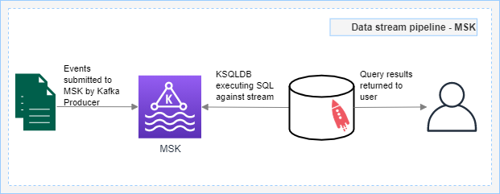
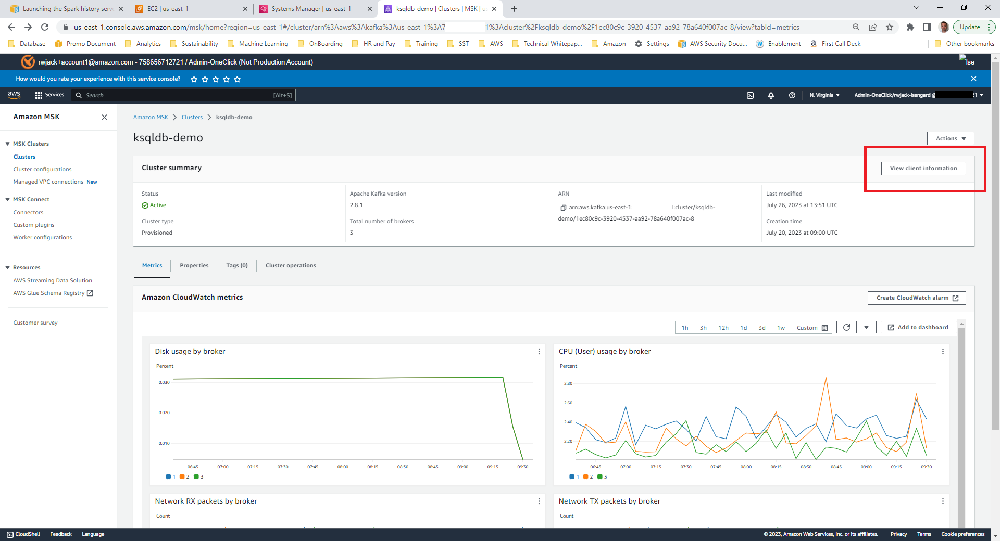
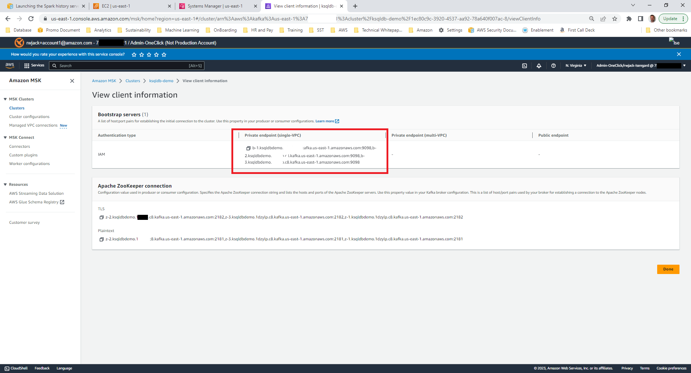
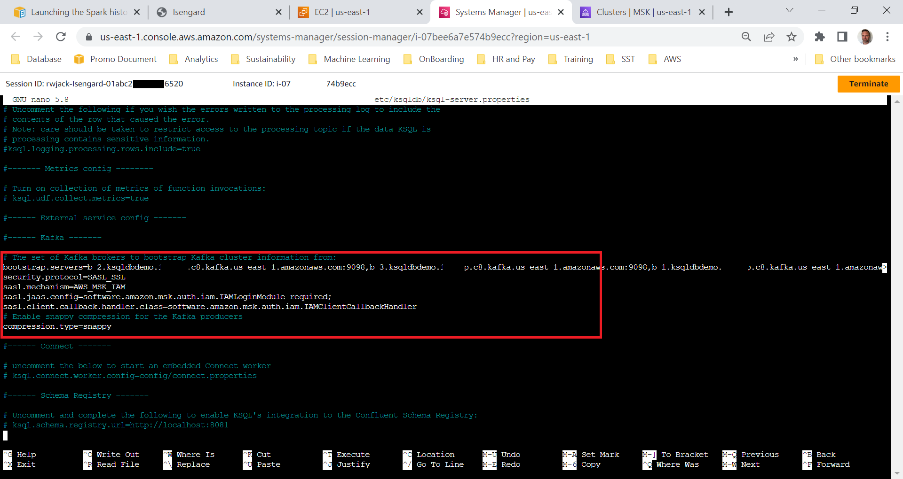
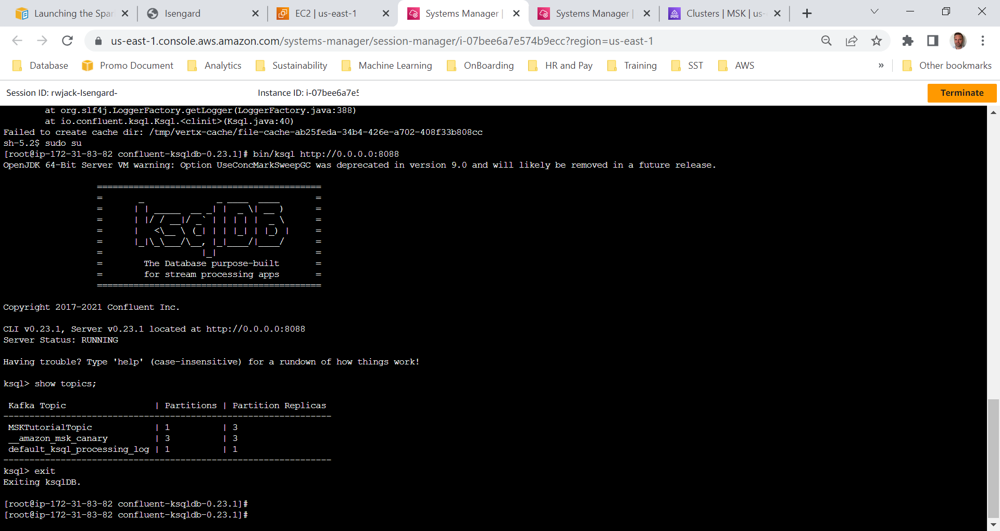

**Integrating KSQL with MSK using IAM Authentication**

When information is generated and processed in real-time, data analysts and data scientists require the ability to query information in a data stream.  

As AWS Kinesis Data Analytics is a managed service it is recommended to use this service to meet this requirement.  Information on how to run real-time analysis using Kinesis can be round here.   There are organisations that want to use only Kafka or more specifically AWS Managed Streaming for Kafka (MSK) to manage their data streams.

**How do you query data in a data stream when using just MSK?**

This post will detail how you can integrate KSQLDB with MSK to allow querying of events in-stream within a Kafka Topic.  KSQLDB provides an interactive framework for performing stream processing activities such as data aggregation, filtering, joining, sessionization, windowing, and more.

KSQLDB is an open source project that is licensed under the Confluent Community License therefore its important to note that KSQLDB is not supported or licensed by AWS.  AWS MSK does not ship with KSQLDB but you can install a version of KSQLDB on an Amazon EC2 instance to query data in your MSK cluster.  KSQLDB can also be installed using containers but this method will not be covered in this upload.  When installing KSQLDB on EC2 your company will be responsible for supporting and maintaining the KSQLDB instance.  

AWS does not publish which versions of MSK supports KSQLDB.

In this example, we will provision a Kafka cluster using AWS MSK, create a Kafka topic, and install and configure KSQLDB to query the Kafka topic that has been created in this workshop.  

The below visual illustrates the architecture and how the solution is designed.   Although not illustrated here, both the Kafka client and KSQLDB will run on the same EC2 instance.




In this tutorial we will create the following resources;

* Amazon EC2 t2.large instance (KSQLDB requires more than one CPU)
* Managed Streaming for Kafka (MSK) cluster with a Kafka Topic
* Kafka Producer – In a production environment the best practice is to leverage MSK Connect to do perform this
* KSQLDB Database

For this tutorial we will be using US-EAST-1
Throughout this tutorial we will go through some of the steps defined in this [development guide](https://docs.aws.amazon.com/msk/latest/developerguide/create-cluster.html) with changes for the configuration of KSQL.  

<h2> Step 1 </h2>

 Complete Step 1: [Create an Amazon MSK cluster](https://docs.aws.amazon.com/msk/latest/developerguide/create-cluster.html) to create a provisioned MSK cluster. Take note of the security group used for the MSK Cluster as you will use this later in the tutorial. It may take up to 60 minutes to deploy this cluster. 

<h2> Step 2 </h2>

Follow the tutorial above and complete Step 2: Create an IAM policy and attach it to a role, remembering to replace region with the code of the AWS region where you created your cluster. Replace Account-ID with your account ID. Replace MSKTutorialCluster with the name of your cluster.

<h2> Step 3 </h2>

Next create an Amazon EC2 instance using the following settings, leaving all others as default.  This will be your client machine to access KSQLDB.
* Name: msk-client-ec2
* Application/OS Image: Amazon Linux 2023 AMI
* Instance size: t3.large or above
* Keypair: Create new (or utilise SSM) 
* Network settings: Select existing security group as per MSK Cluster
* Storage 250GB gp3
* Advanced Details: Select IAM Instance Profile (role) created in [Step 2: Create an IAM role](https://docs.aws.amazon.com/msk/latest/developerguide/create-client-iam-role.html).


<h2> Step 4 </h2>
Once the MSK cluster has provisioned and the EC2 has launched, connect to the EC2 Instance and complete the steps below. You can connect to your EC2 instance via SSH or within the console via Session Manager.

Connect to your EC2 instance and assume sudo. “sudo su”
Navigate to the home directory; ```cd /home```

Create a directory for Kafka and KSQLDB; ```mkdir kafka && cd kafka```

Complete [Step 4: Create a topic](https://docs.aws.amazon.com/msk/latest/developerguide/create-topic.html) within this folder. Note: You will need to replace {YOUR MSK VERSION with the version of MSK deployed (eg. 2.8.1).

<h2> Step 5 </h2>

Now that the MSK cluster is deployed, have a client EC2 instance, and MSK has a topic created, we can install and run KSQLDB.

Connect to your EC2 instance as per step 4 above, and assume sudo. “sudo su”

In this demo we store all files within the Kafka directory (where we downloaded and Kafka client in [Step 4](https://docs.aws.amazon.com/msk/latest/developerguide/create-topic.html))

Navigate to the kafka directory; ```cd /home/kafka```

Download the public key; ```curl -sq http://ksqldb-packages.s3.amazonaws.com/archive/0.23/archive.key | gpg --import```

Download the archive and its signature;```curl http://ksqldb-packages.s3.amazonaws.com/archive/0.23/confluent-ksqldb-0.23.1.tar.gz --output confluent-ksqldb-0.23.1.tar.gz
curl http://ksqldb-packages.s3.amazonaws.com/archive/0.23/confluent-ksqldb-0.23.1.tar.gz.asc --output confluent-ksqldb-0.23.1.tar.gz.asc```

Extract the tarball; ```tar -xf confluent-ksqldb-0.23.1.tar.gz```

Change folder; cd confluent-ksqldb-0.23.1/share/java/ksqldb 
This will download the IAM authentication jar to allow KSQLDB to authenticate using AWS IAM when connecting to MSK; ```wget https://github.com/aws/aws-msk-iam-auth/releases/download/v1.1.1/aws-msk-iam-auth-1.1.1-all.jar```

Switch over to MSK and copy the cluster’s client details locally.  The following image illustrates where you can find the information; 



Copy the endpoint information and save it locally;



Run through these steps;

Next we will update the ksql-server.properties file to allow KSQLDB to authenticate using IAM.  KSQLDB by default doesn’t connect using IAM Authentication therefore we need to instruct it to do so.  This command will open and allow you to update the file; ```nano /home/kafka/confluent-ksqldb-0.23.1/etc/ksqldb/ksql-server.properties```

Update bootstrap.servers and add the additional lines below (we use all three brokers to ensure there isn’t a single point of failure) = ```b-2.ksqldbdemo.XXX.kafka.us-east-1.amazonaws.com:9098,b-3.ksqldbdemo.XXX.kafka.us-east-1.amazonaws.com:9098,b-1.ksqldbdemo.XXX.kafka.us-east-1.amazonaws.com:9098```

<code>security.protocol=SASL_SSL
sasl.mechanism=AWS_MSK_IAM
sasl.jaas.config=software.amazon.msk.auth.iam.IAMLoginModule required;
sasl.client.callback.handler.class=software.amazon.msk.auth.iam.IAMClientCallbackHandler
</code>




Run this command to start the KSQL Server;```
/home/kafka/confluent-ksqldb-0.23.1/bin/ksql-server-start /home/kafka/confluent-ksqldb-0.23.1/etc/ksqldb/ksql-server.properties```

Connect to the Amazon EC2 instance in a new window (either SSH or Session Manager) and 
run the following command to start the KSQL Server; ``` sudo /home/kafka/confluent-ksqldb-0.23.1/bin/ksql http://0.0.0.0:8088 ```

By executing Run ```SHOW TOPICS```; Kafka will return the Topic that was created early in the tutorial.  If everything has gone as planned you should see a screen the same as below;



Congratulations, you have successfully connected KSQLDB to MSK. For more information on KSQLDB see [here](https://ksqldb.io/).